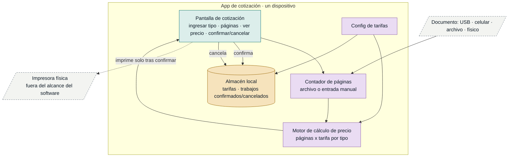

# Arquitectura — Bazar / Papelería (MVP: cotizar antes de imprimir)

La arquitectura se subordina al valor del MVP: **cambiar el orden del proceso**
(cotizar → confirmar → imprimir) sin sacrificar la rapidez ni exigir conocimientos
técnicos. Las fuerzas dominantes son no funcionales y vienen del `inbox/`:

- **R-10 Velocidad** — cotizar en segundos; no alargar la atención (la propietaria
  atiende sola, el cliente valora la rapidez por encima de todo).
- **R-11 Usabilidad unipersonal** — una sola operadora, sin conocimientos técnicos
  ni soporte.
- **R-09 Simplicidad** — hacer lo mismo de hoy, en otro orden; nada de pasos nuevos
  complicados.

Estas fuerzas empujan a una **aplicación local de un solo dispositivo, sin backend
ni cuentas**, optimizada para pocos toques por cotización.

## Componentes

## Cómo cada componente sostiene el valor

| Componente | Historias | Fuerza que atiende |
|---|---|---|
| Pantalla de cotización (UI) | US-01, US-04, US-05 | R-09/R-10/R-11: un solo flujo, pocos toques, sin jerga técnica. |
| Contador de páginas | US-02 | R-03: obtener páginas sin imprimir; con fallback manual para no bloquear (R-10). |
| Motor de cálculo | US-01 | R-01: precio = f(páginas, tarifa) antes de imprimir. |
| Config de tarifas | US-03 | R-04: precios reales, no fijos. |
| Almacén local | US-04 (y posterior US-06…US-09) | Persistir tarifas y decisiones sin servidor (R-11). |

## Flujo del MVP (cotizar → confirmar → imprimir)
1. La propietaria elige tipo (B/N o color) e indica páginas (auto desde archivo o manual) → **US-02**.
2. El motor calcula el precio con la tarifa configurada → **US-01 + US-03**.
3. Se muestra el precio; el cliente lo conoce y decide → **US-04 + US-05**.
4. Solo si confirma, se imprime; si cancela, no se gasta insumo (queda el rastro para el backlog posterior).

## Decisiones registradas (ADRs)
- **ADR-0001** — Conteo de páginas por formato, con entrada manual como fallback.
- **ADR-0002** — Persistencia local en un solo dispositivo, sin backend.

## Lo que se decide NO hacer todavía (open questions)
- **Sin backend, cuentas ni sincronización** — no hay evidencia de multi-dispositivo
  ni multiusuario; añadirlo violaría R-11 y R-09. Reabrir solo si aparece esa necesidad.
- **Sin costeo de insumos ni reportes** (US-08, US-09) — fuera del MVP; el almacén
  local se diseña para poder añadirlos después sin migración mayor.
- **Supuesto de negocio abierto (del MVP Canvas):** falta probar que cotizar antes
  *reduce* el insumo perdido por semana (hoy es intuición + deseo declarado). La
  arquitectura mantiene el costo de construcción bajo justamente para permitir ese
  experimento barato antes de invertir más.
- **Rendimiento del conteo automático por formato** — a validar en US-02; ver ADR-0001.
