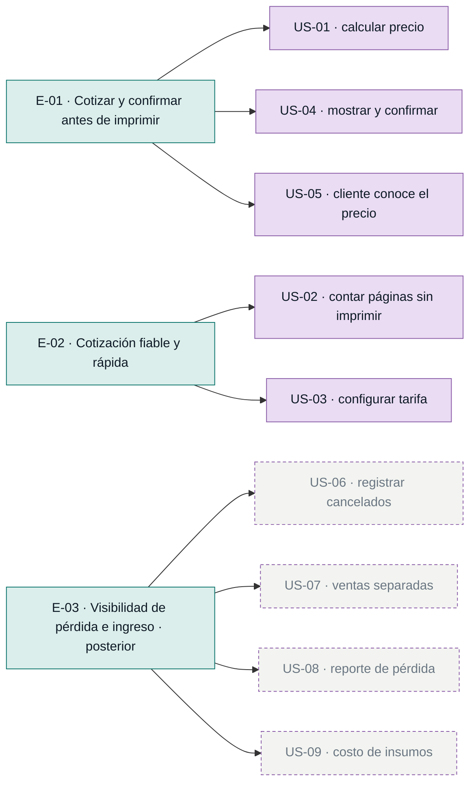

# Épicas y backlog — Bazar / Papelería

Descomposición del MVP (`mvp-canvas.md`) en épicas ordenadas por valor
(output → outcome → impact). Cada épica traza a ítems del descubrimiento; ninguna
inventa alcance. El núcleo del MVP son **US-01…US-05**; **US-06…US-09** se declaran
fuera del alcance inicial (el MVP Canvas los pone en *Fuera de alcance por ahora*).

## E-01 · Cotizar y confirmar el precio antes de imprimir
**Valor (outcome):** el cliente decide **antes** de que se gaste insumo; el patrón
imprimir-antes-de-cotizar deja de ocurrir y baja el número de impresiones
rechazadas tras impresas (métrica de éxito del MVP).
**Origen:** mvp:propuesta-valor, mvp:funcionalidades-minimas, mvp:outcome,
us:US-01, us:US-04, us:US-05, req:R-01, req:R-02.
**Prioridad:** 1
**Historias:** US-01, US-04, US-05

## E-02 · Preparar una cotización fiable y rápida
**Valor (outcome):** la propietaria obtiene el número de páginas sin imprimir y
aplica sus tarifas reales, para que el precio de E-01 sea correcto y se calcule
rápido sin alargar la atención (R-10). Son los habilitadores del cálculo.
**Origen:** mvp:funcionalidades-minimas, us:US-02, us:US-03, req:R-03, req:R-04,
req:R-10.
**Prioridad:** 2
**Historias:** US-02, US-03

## E-03 · Dar visibilidad a la pérdida y al ingreso (fuera del MVP inicial)
**Valor (outcome):** la propietaria deja de solo *percibir* la pérdida y pasa a
dimensionarla, separando ingresos de impresiones y papelería y estimando el costo
real de insumos. Backlog posterior: el MVP Canvas lo declara fuera de alcance hasta
probar el núcleo cotizar→imprimir.
**Origen:** mvp:fuera-de-alcance, us:US-06, us:US-07, us:US-08, us:US-09, req:R-05,
req:R-06, req:R-07, req:R-08.
**Prioridad:** 3
**Historias:** US-06, US-07, US-08, US-09

## Diagrama del backlog

## Restricciones transversales (no funcionales, aplican al MVP)
- **R-09 Simplicidad** — no agregar pasos complicados; hacer lo mismo, en otro orden.
- **R-10 Velocidad** — cotizar rápido, sin sacrificar la rapidez que el cliente valora.
- **R-11 Usabilidad unipersonal** — operable por una sola persona sin conocimientos técnicos.

## Justificación de prioridad (por valor)
1. **E-01** entrega directamente el outcome del MVP (decidir antes de gastar insumo).
2. **E-02** habilita a E-01: sin conteo de páginas y tarifas reales, el precio no es
   confiable ni rápido. Es prerrequisito técnico, no valor en sí mismo.
3. **E-03** dimensiona el problema y separa ingresos, pero el MVP Canvas lo aplaza
   hasta validar que cotizar antes reduce el insumo perdido.
