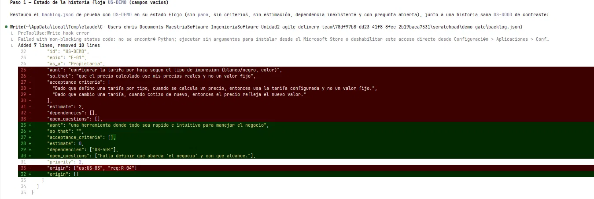
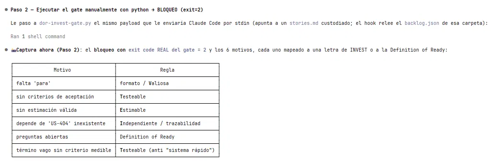
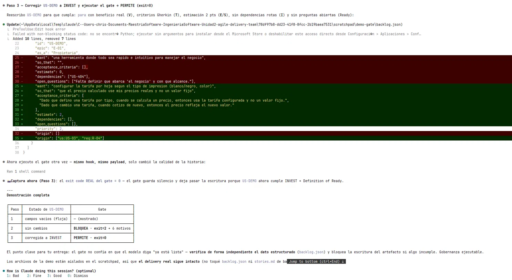

# Evidencia del gate DoR / INVEST — bazarpapeleria

**Universidad Politécnica Salesiana**

**Maestría en Software**  

**Nombre:** Christian Naranjo  

**Fecha:** 30/06/2026

**Proyecto:** Agile Delivery Team — caso bazarpapeleria

---

## ¿Qué es el gate DoR / INVEST?

El hook `dor-invest-gate.py` es un control de calidad automatizado que se ejecuta antes de escribir `stories.md` o `sprint-plan.md`. Valida que cada historia en `backlog.json` cumpla con el formato INVEST (Independiente, Negociable, Valiosa, Estimable, Small, Testeable) y la Definition of Ready. Si alguna historia incumple, bloquea la escritura y señala con precisión qué falta. La validación se hace sobre el dato estructurado, no sobre la prosa — no se puede esquivar renombrando el artefacto.

---

## Paso 1 — Historia floja (US-DEMO con campos vacíos)

Se preparó una historia de prueba con campos deliberadamente incompletos: sin `so_that`, sin criterios de aceptación, sin estimación, con una dependencia inexistente (US-404) y con preguntas abiertas sin resolver.

*Captura 1 — Diff entre la historia sana (rojo, eliminada) y la historia floja US-DEMO (verde, agregada) con todos los campos problemáticos visibles.*

---

## Paso 2 — El gate bloquea (exit = 2)

Se ejecutó el gate manualmente con el mismo payload que Claude Code le enviaría por stdin. El gate respondió con código de salida 2 y 6 motivos exactos, cada uno mapeado a una letra de INVEST o a la Definition of Ready.

*Captura 2 — Bloqueo del gate DoR/INVEST: exit=2 con los 6 motivos de rechazo mapeados a las reglas de calidad.*

| Motivo | Regla |
|--------|-------|
| falta 'para' | formato / Valiosa |
| sin criterios de aceptación | Testeable |
| sin estimación válida | Estimable |
| depende de 'US-404' inexistente | Independiente / trazabilidad |
| preguntas abiertas | Definition of Ready |
| término vago sin criterio medible | Testeable (anti "sistema rápido") |

---

## Paso 3 — Resolución y permiso (exit = 0)

Se corrigió US-DEMO agregando todos los campos que faltaban: `so_that` con beneficio real, criterios de aceptación en formato Gherkin, estimación de 2 puntos, dependencias vacías y preguntas abiertas resueltas. El mismo gate, con el mismo payload, respondió con exit=0.

*Captura 3 — Corrección de US-DEMO a INVEST completo y resultado del gate: exit=0, la escritura procede.*

---

## Resumen

| Paso | Estado de US-DEMO | Gate |
|------|-------------------|------|
| 1 | campos vacíos (floja) | — (mostrado) |
| 2 | sin cambios | BLOQUEA · exit=2 + 6 motivos |
| 3 | corregida a INVEST | PERMITE · exit=0 |

El gate no confía en que el modelo declare una historia "lista" — verifica de forma independiente el dato estructurado (`backlog.json`) y bloquea la escritura del artefacto si algo incumple. La única manera de pasar el gate es corrigiendo la historia real, no esquivando la regla.
